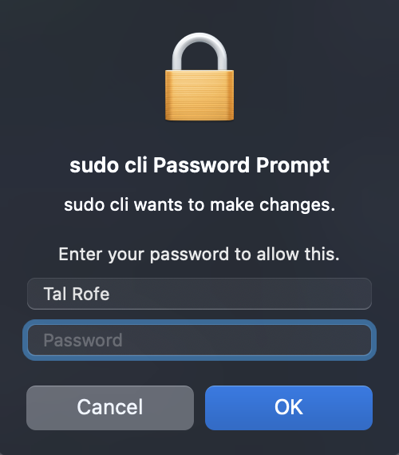

<p align="center">
	<a href="https://github.com/tal-rofe/sudo-cli">
    	
  	</a>
	<a href="https://www.npmjs.com/package/sudo-cli">
    	
  	</a>
	<a href="https://github.com/tal-rofe/sudo-cli">
    	
  	</a>
	<a href="https://github.com/tal-rofe/sudo-cli">
    	
  	</a>
</p>

<p align="center"></p>

<h1 align="center">sudo-cli</h1>

> Run any script with privileged permissions, prompting the user with a graphical OS dialog if necessary

<p align="center"></p>

**This package is under development (and slow one.. 😐) so feel free to help it by making a PR**

## Installation

**Globally**

```bash
npm install --global sudo-cli
```

**Locally**

```bash
npm install --save-dev sudo-cli
```

## Usage

You need to provide the name of your application for your application (optional) and the command to be executed with privileged permissions.

```sh
$ sudo-cli --name "[your app name]" "<command to run>"
```

## ESM support

sudo-cli supports **only** ESM modules. For any issue regarding this, please visit this link https://gist.github.com/sindresorhus/a39789f98801d908bbc7ff3ecc99d99c

## Support

For support, email talrofe111@gmail.com or open an issue at [sudo-cli issues](https://github.com/tal-rofe/sudo-cli/issues).

## Contributing

Contributions are always welcome!

See `CONTRIBUTING.md` for ways to get started.

Please adhere to this project's `CODE_OF_CONDUCT.md`.

If you want to make PR please first check your code by:

1. Run `pnpm i` to install dependencies
2. Build your source code by running `pnpm build`
3. Run `node ./bin/sudo-cli.js -n "test" "test"` and check results of your code

## Authors

-   [@tal-rofe](https://github.com/tal-rofe)

## License

[MIT](https://choosealicense.com/licenses/mit/)
